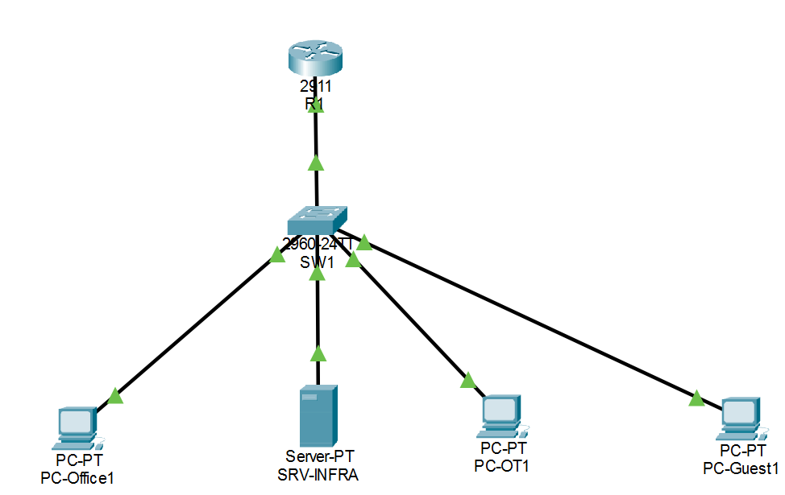

# Semiconductor Factory Network Lab

A networking lab where I redesigned a factory network from a single flat 
segment into four isolated zones — Office, Server, OT (production machines), 
and Guest — using VLANs, inter-VLAN routing, DHCP relay, internal DNS, and 
ACLs to control who can talk to whom.

Built in Cisco Packet Tracer. No real hardware needed.

---

## Why I Built This

Imagine a semiconductor factory where every device — office PCs, database 
servers, production PLCs, and guest WiFi — all sit on the same network. 
One subnet. No separation.

That sounds convenient until you think about it:

- A guest's infected laptop can scan and reach the production server.
- A malware in the office VLAN can spread to a machine that's mid-production.
- Nobody can enforce "OT machines should only talk to the database, nothing else".
- It fails every industrial security audit out there (IEC 62443, ISO 27001).

A flat network is basically an office building where every door is unlocked. 
Anyone can walk into any room.

So I fixed it. This lab shows how.

---

## What I Actually Did

Short version: split the network into 4 VLANs, made the router the gateway 
for each one, added a DHCP + DNS server, then locked down inter-VLAN traffic 
with ACLs so each zone only reaches what it's supposed to.

Longer version is in the sections below.

---

## Topology



```
                    [ R1 - Router 2911 ]
                            |
                     (trunk, 802.1Q)
                            |
                    [ SW1 - Switch 2960 ]
        ____________________|____________________
        |            |            |              |
   PC-Office1   SRV-INFRA      PC-OT1       PC-Guest1
   (VLAN 10)    (VLAN 20)     (VLAN 30)     (VLAN 40)
```

One cable from the router to the switch carries all four VLANs using 802.1Q 
trunking. The router splits that single physical link into virtual 
sub-interfaces — one for each VLAN — so each zone gets its own gateway.

---

## VLAN & Addressing Plan

| VLAN | Name          | Subnet           | Gateway       | What's In It              |
|------|---------------|------------------|---------------|---------------------------|
| 10   | OFFICE        | 192.168.10.0/24  | 192.168.10.1  | Employee PCs              |
| 20   | SERVER        | 192.168.20.0/24  | 192.168.20.1  | DNS, DHCP, HTTP server    |
| 30   | PRODUCTION-OT | 192.168.30.0/24  | 192.168.30.1  | PLC / production machines |
| 40   | GUEST         | 192.168.40.0/24  | 192.168.40.1  | Guest WiFi / visitors     |
| 99   | NATIVE        | —                | —             | Native VLAN (trunk only)  |

**DHCP pools** live on the server (192.168.20.10). Since the server is in a 
different VLAN than the clients, the router forwards DHCP requests using 
`ip helper-address` — that's DHCP relay in action.

Static IPs (`.2` to `.99`) are reserved for printers, PLCs, and anything 
that needs a fixed address. DHCP hands out `.100` and up.

---

## Who Can Talk To Whom

This is the whole point of the lab. Before ACLs, everyone could reach 
everyone. After ACLs, it looks like this:

| From ↓ / To → | Office | Server               | OT  | Guest |
|---------------|--------|----------------------|-----|-------|
| **Office**    | ✅     | ✅                   | ❌  | ❌    |
| **Server**    | ✅     | ✅                   | ✅  | ❌    |
| **OT**        | ❌     | DNS, HTTP, ping only | ✅  | ❌    |
| **Guest**     | ❌     | DNS only             | ❌  | ✅    |

A few things worth pointing out:

- **OT machines can only reach the server for DNS, HTTP, and ping.** Nothing 
  else. They can't talk to office PCs or guests.
- **Guest devices can resolve DNS** (so captive portals etc. would work), but 
  can't reach any internal network. Ping to the server? Blocked.
- **Server replies are allowed**, because ACLs are applied only on the source 
  VLAN interfaces (inbound). Replies from Server → OT don't need explicit 
  permits.

---

## How It's Configured

Three main pieces:

### 1. VLANs and Trunking (SW1)

Access ports for the PCs and server, one trunk port going up to the router.

```
vlan 10 → OFFICE
vlan 20 → SERVER
vlan 30 → PRODUCTION-OT
vlan 40 → GUEST
vlan 99 → NATIVE

interface fa0/1  → trunk, native vlan 99, allowed vlans 10,20,30,40,99
interface fa0/2  → access vlan 20 (server)
interface fa0/3  → access vlan 10 (office)
interface fa0/4  → access vlan 30 (OT)
interface fa0/5  → access vlan 40 (guest)
```

### 2. Router-on-a-Stick (R1)

The router's single GigabitEthernet0/0 interface is split into 5 
sub-interfaces. Each one carries one VLAN with a `dot1Q` tag and owns 
the gateway IP for that subnet.

```
interface gi0/0.10  → encapsulation dot1Q 10  → 192.168.10.1 + ip helper-address
interface gi0/0.20  → encapsulation dot1Q 20  → 192.168.20.1
interface gi0/0.30  → encapsulation dot1Q 30  → 192.168.30.1 + ip helper-address
interface gi0/0.40  → encapsulation dot1Q 40  → 192.168.40.1 + ip helper-address
interface gi0/0.99  → encapsulation dot1Q 99 native
```

### 3. Access Control Lists (R1)

Three extended ACLs, one per source zone, applied inbound on the 
corresponding sub-interface. Full configs are in [`configs/`](configs/).

One gotcha I ran into and want to highlight: **you must permit DHCP before 
anything else in the ACL**. Without this line:

```
permit udp any eq 68 any eq 67
```

...clients lose their IP the moment you apply the ACL, because their 
DHCP renewal packets get blocked. I learned this the hard way.

---

## Test Results

All tests done in Packet Tracer. Full table in 
[`test-results.md`](test-results.md), but here's the summary:

| # | From         | To                    | Expected    | Got          |
|---|--------------|-----------------------|-------------|--------------|
| 1 | PC-Office1   | SRV-INFRA (ping)      | ✅ Allowed  | ✅ Reply     |
| 2 | PC-Office1   | PC-OT1                | ❌ Blocked  | ✅ Unreach   |
| 3 | PC-Office1   | PC-Guest1             | ❌ Blocked  | ✅ Unreach   |
| 4 | PC-OT1       | SRV-INFRA (ping/HTTP) | ✅ Allowed  | ✅ Reply     |
| 5 | PC-OT1       | PC-Office1            | ❌ Blocked  | ✅ Unreach   |
| 6 | PC-Guest1    | SRV-INFRA (ping)      | ❌ Blocked  | ✅ Unreach   |
| 7 | PC-Guest1    | DNS resolution        | ✅ Allowed  | ✅ Resolved  |
| 8 | All PCs      | DHCP                  | ✅ Allowed  | ✅ Got IP    |

I also checked the ACL hit counters (`show access-lists`) after each test — 
the deny/permit counters increment exactly as expected, which confirms the 
ACLs are actually doing the filtering (not just sitting there).

---

## Things I Learned

A few honest lessons from this lab:

1. **Save your work constantly.** Packet Tracer doesn't autosave. I lost 
   my config twice and had to redo everything. Now I hit Ctrl+S every 
   few minutes and turn on the auto-save preference.

2. **ACLs process top-down with an implicit deny at the end.** Order 
   matters. A specific `permit` must come before a broad `deny`, otherwise 
   traffic gets eaten.

3. **DHCP relay is easy to forget.** If you don't put `ip helper-address` 
   on the client VLAN's sub-interface, DHCP broadcast never reaches the 
   server. Clients sit with 169.254.x.x addresses forever.

4. **Packet Tracer PCs have stale ARP caches.** If a PC suddenly can't 
   ping anything despite correct config, power-cycle it. Nine times out 
   of ten, that fixes it.

5. **Native VLAN mismatch is silent.** If the switch's trunk has native 
   VLAN 99 but the router's sub-interface doesn't, you'll get weird 
   behavior. Always match them.

More troubleshooting stories in [`troubleshooting.md`](troubleshooting.md).

---

## Repo Structure

```
.
├── README.md                  ← you're here
├── diagram/
│   └── topology.png           ← network diagram
├── configs/
│   ├── R1.txt                 ← router running-config
│   └── SW1.txt                ← switch running-config
├── test-results.md            ← ACL test matrix + expected vs actual
├── troubleshooting.md         ← issues I hit and how I fixed them
└── lab.pkt                    ← Packet Tracer file (open in PT to explore)
```

---

## Tools Used

- **Cisco Packet Tracer** — network simulation
- **VLANs + 802.1Q** — logical segmentation over one physical link
- **Router-on-a-Stick** — inter-VLAN routing via sub-interfaces
- **DHCP relay** — reaching a DHCP server from a different VLAN
- **Extended ACLs** — enforcing zone-to-zone access policy
- **Cisco IOS** — switch and router config

---

## What I'd Add Next

If I keep building on this:

- Add a simulated internet connection on R1's Gi0/1, with NAT for the 
  office and guest VLANs.
- Replace the router-on-a-stick with a **Layer 3 switch** — that's closer 
  to how real factory networks are built.
- Add **port security** and **DHCP snooping** on SW1.
- Enable **SSH** for management instead of console/telnet.
- Rebuild it in **GNS3** or **EVE-NG** as a step up from Packet Tracer.

---

## About

Personal lab project. Built while learning network segmentation for 
industrial environments. If you're hiring for IT/OT network roles and 
want to talk shop, feel free to reach out.